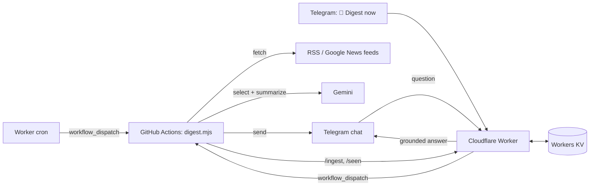

# news-digest-bot

A personal daily news digest for Telegram: RSS feeds are filtered and summarized by Gemini for a reader profile you write in plain words, and a companion bot answers follow-up questions with Google Search grounding.

<!-- screenshot: telegram digest -->

Zero npm dependencies. Runs on GitHub Actions (digest) and a Cloudflare Worker (bot, scheduling, dedup state).

## How it works



1. The Worker's cron fires at an exact time and dispatches the GitHub Actions workflow (GitHub's own cron is best-effort and is disabled after 60 idle days).
2. `digest.mjs` fetches the feeds, drops stale items and title duplicates, and sends Gemini a numbered headline list. The model cites stories as `{{N}}` and the script substitutes the real links, so long Google News URLs never pass through the model.
3. The digest is split into Telegram-sized chunks without breaking links and sent.
4. The latest digest is pushed to the Worker (`/ingest`), so the bot can answer questions like "tell me more about the third story".

## Features

- **Daily digest**: picks 8–16 stories for your persona, grouped by topic, with source links.
- **Local section** (optional): a separate block for your city, built from its own feeds with a 72 h window, a place-name filter and its own model call, so local news is not crowded out by world news. The main digest is told to skip city stories only when the local section was actually produced.
- **Cross-run dedup**: local stories already sent are remembered in Workers KV for 7 days (`/seen/check`, `/seen/mark`). Failures there degrade to "nothing seen", never to a lost digest.
- **Q&A bot**: any message to the bot is answered by Gemini with Google Search grounding, with the latest digest and recent conversation as context. Reply to a digest message to ask about it.
- **"📰 Digest now" button**: sends a digest outside the schedule.
- **Resilient model calls**: a fallback ladder of Gemini models with per-model time shares, retries on 429/503, and an overall time budget.

## Setup

### 1. Fork and configure

Fork the repo, then describe your reader in a config module:

```bash
cp digest.config.example.mjs digest.config.mjs   # gitignored
```

You can store your config in two ways:

- **Private (recommended for a public fork):** paste the whole contents of your `digest.config.mjs` into a repository secret named `DIGEST_CONFIG`. The workflow writes it to `digest.config.mjs` before each run.
- **Committed:** in a private fork, remove `digest.config.mjs` from `.gitignore` and commit it.

If neither is present, the neutral `digest.config.example.mjs` is used.

### 2. Telegram and Gemini

- Create a bot with [@BotFather](https://t.me/BotFather) and note its token.
- Find your Telegram user id (for example, by messaging [@userinfobot](https://t.me/userinfobot)).
- Get a Gemini API key from [Google AI Studio](https://aistudio.google.com/).

### 3. GitHub Actions secrets

Repository Settings → Secrets and variables → Actions:

| Name | Required | Value |
|---|---|---|
| `GEMINI_API_KEY` | yes | Gemini API key |
| `TELEGRAM_BOT_TOKEN` | yes | bot token from @BotFather |
| `TELEGRAM_CHAT_ID` | yes | your Telegram user id |
| `INGEST_URL` | for the bot | `https://<your-worker>.<your-subdomain>.workers.dev/ingest` |
| `INGEST_SECRET` | for the bot | random string, same value as the Worker secret |
| `DIGEST_CONFIG` | no | full source of your `digest.config.mjs` |

You can now run the workflow by hand (Actions → Daily news digest → Run workflow). Without the Worker it has no schedule.

### 4. Deploy the Worker

```bash
cd worker
cp wrangler.example.toml wrangler.toml            # gitignored
wrangler kv namespace create KV                  # put the id into wrangler.toml
for s in ALLOWED_CHAT_ID GH_REPO GH_TOKEN TELEGRAM_BOT_TOKEN GEMINI_API_KEY WEBHOOK_SECRET INGEST_SECRET; do
  wrangler secret put "$s"
done
wrangler deploy
```

`GH_REPO` is `<owner>/<repo>` of your fork. `GH_TOKEN` is a fine-grained token with **Actions: read and write** on that repo only. Adjust the cron in `wrangler.toml` (UTC).

Then point Telegram at the Worker:

```bash
curl "https://api.telegram.org/bot<TELEGRAM_BOT_TOKEN>/setWebhook" \
  -d url="https://<your-worker>.<your-subdomain>.workers.dev/webhook" \
  -d secret_token="<WEBHOOK_SECRET>"
```

The bot answers only the chat whose id equals `ALLOWED_CHAT_ID`.

## Configuration reference

`digest.config.mjs` exports:

| Export | Required | Description |
|---|---|---|
| `PERSONA` | yes | Plain-text reader profile: what matters, what to skip. Written for the model, so any language works. |
| `FEEDS` | yes | Array of `{ url }` RSS sources for the main digest. Google News search works well: `https://news.google.com/rss/search?q=<query>&hl=<lang>` |
| `OUTPUT` | no | `{ language, locale, timeZone, title, topics }`. Defaults to `English`, `en-GB`, `UTC`, `📰 Digest` and a generic topic hint. |
| `local` | no | Local section settings (below). Omit or set to `null` to disable the section. |

`local`:

| Field | Required | Description |
|---|---|---|
| `name` | yes | City name, used in the prompt, in the header and in the main digest's skip rule. |
| `feeds` | yes | Array of `{ url, official? }`. `official: true` marks the city's own feed, which bypasses the place filter. |
| `places` | no | Regex fragments (or a `RegExp`) matched case-insensitively against title, description and source. Items that match none are dropped before the model sees them. Omit to keep every item. |
| `nearby` | no | Nearby places that count for events, culture and transport, but not for crime and incidents. |
| `skipTopics` | no | Topics the model must drop, e.g. local sports clubs. |
| `header` | no | Section header, default `🏘 <name>`. |

Worker settings live in `worker/wrangler.toml`: `GH_WORKFLOW` (default `digest.yml`) and `BOT_LANGUAGE` (default `English`) as vars, everything else as secrets (see `worker/wrangler.example.toml`).

## Development

```bash
node --test                                      # unit tests, no network
DRY_RUN=1 GEMINI_API_KEY=… node digest.mjs       # full pipeline against live feeds, prints instead of sending
DIGEST_CONFIG_PATH=./other.config.mjs DRY_RUN=1 GEMINI_API_KEY=… node digest.mjs
```

Use bare `node --test`: on Node 24 `node --test tests/` treats the directory as a file to execute.

Code layout:

- `digest.mjs`: the pipeline (collect → select → prompt → send → mark seen → ingest)
- `lib/config.mjs`: config resolution and validation
- `lib/feed.mjs`: RSS parsing, freshness window, dedup, local place filter
- `lib/prompts.mjs`: Gemini prompts built from config
- `lib/gemini.mjs`: model fallback ladder with time budgets
- `lib/format.mjs`, `lib/telegram.mjs`: link substitution and chunked delivery
- `lib/seen.mjs`: cross-run dedup client
- `worker/src/index.js`: Telegram webhook, Q&A, cron dispatch, KV endpoints


## License

MIT — see [LICENSE](LICENSE).
